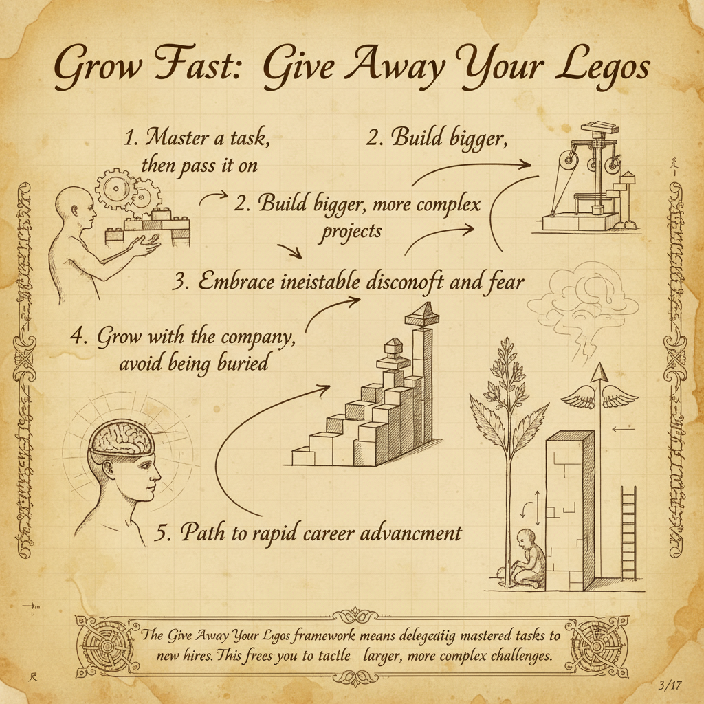
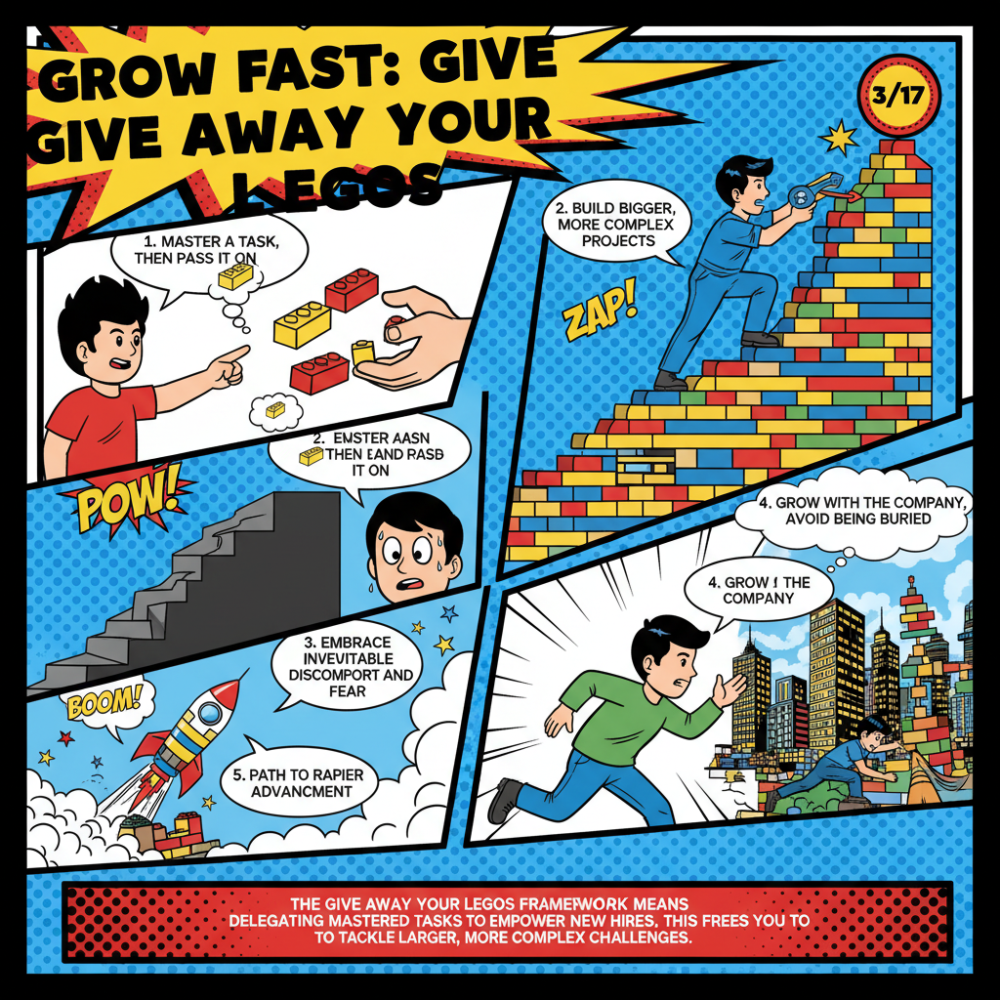
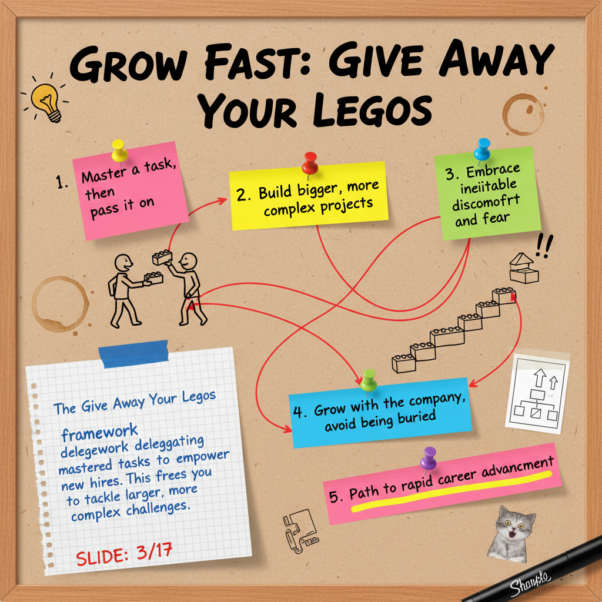

# youtube-to-slides

Convert YouTube videos into infographic slides using Gemini AI. Extracts the transcript, segments it into sections, summarizes each, and generates stylized infographic images.

4 visual styles: **davinci**, **magazine**, **comic**, **geek**






## Prerequisites

- Python 3.9+
- [Gemini API key](https://aistudio.google.com/apikey)
- [YouTube Data API key](https://console.cloud.google.com/apis/library/youtube.googleapis.com)

## Setup

```bash
# Clone the repo
git clone <repo-url>
cd youtube-to-slides

# Create virtual environment and install
python3 -m venv .venv
source .venv/bin/activate
pip install -e .

# Configure API keys
cp .env.example .env
# Edit .env and add your keys:
#   GEMINI_API_KEY=your_key
#   YOUTUBE_API_KEY=your_key
```

## Usage

### CLI

```bash
# Basic — generates slides in davinci style
yt-slides "https://youtu.be/VIDEO_ID"

# Choose a style
yt-slides "https://youtu.be/VIDEO_ID" --style comic

# Limit number of slides
yt-slides "https://youtu.be/VIDEO_ID" --style magazine --max-sections 5

# Change aspect ratio (default: 16:9)
yt-slides "https://youtu.be/VIDEO_ID" --ar 1:1

# Dry run — shows prompts without generating images
yt-slides "https://youtu.be/VIDEO_ID" --dry-run
```

### All CLI Options

| Option | Default | Description |
|--------|---------|-------------|
| `--style` | `davinci` | Style preset: `davinci`, `magazine`, `comic`, `geek` |
| `--max-sections` | `0` (unlimited) | Maximum number of slides to generate |
| `--ar` | `16:9` | Aspect ratio: `16:9`, `4:3`, `1:1` |
| `--output`, `-o` | `./output` | Output directory |
| `--dry-run` | off | Preview prompts without generating images |
| `--gemini-key` | from `.env` | Gemini API key (overrides env) |
| `--youtube-key` | from `.env` | YouTube API key (overrides env) |

### Claude Code Integration

This repo includes a Claude Code agent skill. When you open the project in Claude Code, just ask naturally:

> Generate slides from https://youtu.be/VIDEO_ID in comic style

Claude will run the pipeline and show you the results. No slash commands needed.

## Output

Slides are saved to `output/<video_id>/`:

```
output/
└── GcNu6wrLTJc/
    ├── metadata.json
    ├── 01_introduction_problem_statement.png
    ├── 02_todays_sponsor_daytona.png
    ├── 03_understanding_ai_context_hierarchy.png
    └── ...
```

`metadata.json` contains video info and a mapping of section titles to image files.

## Styles

### davinci (default)
Renaissance-era scientific manuscript. Hand-drawn ink on aged parchment with anatomical diagrams and cross-hatching. Best for educational, science, and history content.

### magazine
High-end editorial spread. Black and white with Swiss typography, razor-thin rules, and dramatic contrast. Best for business, interviews, and professional content.

### comic
Vibrant pop art. Bold outlines, Ben-Day dots, speech bubbles, and starburst shapes. Best for entertainment, tutorials, and casual content.

### geek
College bulletin board. Corkboard background with sticky notes, marker text, doodles, and red string connections. Best for study notes, brainstorming, and informal content.

## Project Structure

```
src/yt_slides/
├── cli.py              # Typer CLI entry point
├── config.py           # Settings (API keys, defaults)
├── models.py           # Pydantic data models
├── pipeline.py         # Main orchestration pipeline
├── ai/
│   ├── gemini_client.py    # Gemini API wrapper
│   ├── prompt_builder.py   # Style presets & prompt generation
│   ├── segmenter.py        # Transcript → sections
│   └── summarizer.py       # Section → summary
├── image/
│   └── generator.py        # Image generation via Gemini
└── youtube/
    ├── chapters.py         # YouTube chapter extraction
    ├── metadata.py         # Video metadata fetching
    ├── transcript.py       # Transcript extraction
    └── url_parser.py       # URL parsing & validation
```

## Troubleshooting

| Problem | Fix |
|---------|-----|
| `429 Too Many Requests` | Built-in retry handles this. If persistent, wait 60s or reduce `--max-sections` |
| No transcript available | Video needs captions enabled (auto-generated or manual) |
| Invalid URL | Use `youtu.be/ID` or `youtube.com/watch?v=ID` format |
| API key errors | Check your `.env` file has valid keys |
| `yt-slides` not found | Run `pip install -e .` in the virtual environment |

## License

MIT
